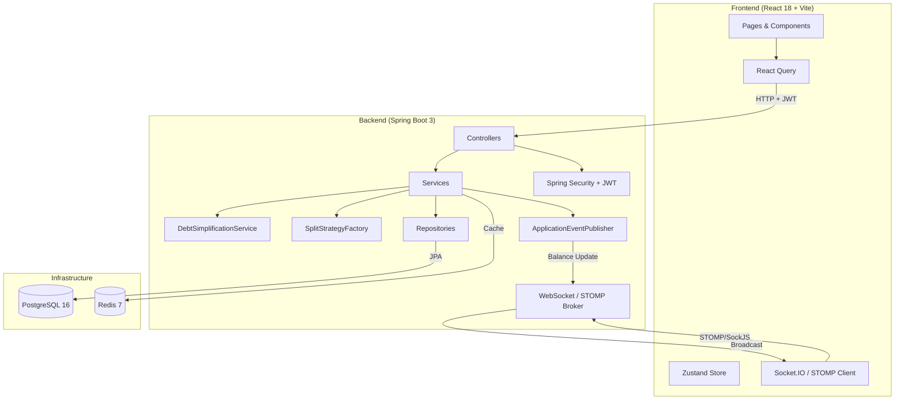

# SettleUp — Smart Group Expense Manager

> Eliminate redundant IOUs. SettleUp computes the **minimum number of transactions** to settle all debts in a group using a greedy debt-simplification algorithm.

[](https://github.com/YOUR_USERNAME/settleup/actions)


---

## 🚀 Live Demo & Demo Account

- **Frontend Application (Vercel):** `https://settleup-app.vercel.app` (or your deployed Vercel URL)
- **Backend API Service (Render):** `https://settleup-backend.onrender.com`

### 🔑 Instant Demo Login
You can log in directly using the pre-seeded demo account to explore pre-configured groups, expenses, and simplified balances:
- **Email:** `demo@settleup.app`
- **Password:** `password123`

*(Alternatively, click **Create Account** to register a new user account).*

---

## Table of Contents

- [Live Demo & Demo Account](#-live-demo--demo-account)
- [The Problem](#the-problem)
- [Debt Simplification Algorithm](#debt-simplification-algorithm)
- [Architecture](#architecture)
- [Tech Stack](#tech-stack)
- [Features](#features)
- [Getting Started](#getting-started)
- [API Documentation](#api-documentation)
- [Running Tests](#running-tests)
- [Deployment](#deployment)

---

## The Problem

When a group shares expenses, members end up with many overlapping IOUs:

```
Alice → Bob: $20
Bob → Charlie: $15
Charlie → Alice: $10
Dave → Alice: $30
```

This is 4 transactions. SettleUp computes the **net balance** of each person and finds the minimal set of payments that zeros everyone out — in this case just 2 or 3 transactions.

---

## Debt Simplification Algorithm

### How it Works

**Step 1: Compute Net Balances**
```
For each expense:
  payer.balance  += total_amount
  each_participant.balance -= their_split_amount

For each completed settlement:
  fromUser.balance += settlement_amount
  toUser.balance   -= settlement_amount
```

**Step 2: Greedy Priority-Queue Matching**
```
creditors = max-heap of members with balance > 0   (owed money)
debtors   = max-heap of members with balance < 0   (owe money)

while creditors and debtors are not empty:
  creditor = creditors.poll()   // member owed most
  debtor   = debtors.poll()     // member who owes most

  amount = min(creditor.balance, |debtor.balance|)
  record transaction: debtor → creditor, amount

  update remaining balances
  re-insert if still non-zero
```

**Example:**
```
Alice paid $90 dinner (split equally among Alice, Bob, Charlie):
  Alice: +90 - 30 = +60  (creditor)
  Bob:    0  - 30 = -30  (debtor)
  Charlie: 0 - 30 = -30  (debtor)

Minimum transactions:
  Bob     → Alice:  $30
  Charlie → Alice:  $30

2 transactions (vs 3 direct IOUs)
```

### Step-by-Step Manual Trace (Non-Trivial 4-Person Scenario)

**Scenario:** 4 group members (Alice, Bob, Charlie, Dave) with 3 overlapping expenses:
1. **Expense 1:** Alice pays $120 split 4 ways ($30 each: Alice, Bob, Charlie, Dave).
2. **Expense 2:** Bob pays $80 split 2 ways ($40 each: Bob, Charlie).
3. **Expense 3:** Dave pays $60 split 2 ways ($30 each: Alice, Dave).

**Phase 1: Net Balance Calculation**
- **Alice:** Paid $120. Owes $30 (E1) + $30 (E3) = $60. Net balance = `+120 - 60 = +$60` (Creditor)
- **Bob:** Paid $80. Owes $30 (E1) + $40 (E2) = $70. Net balance = `+80 - 70 = +$10` (Creditor)
- **Charlie:** Paid $0. Owes $30 (E1) + $40 (E2) = $70. Net balance = `0 - 70 = -$70` (Debtor)
- **Dave:** Paid $60. Owes $30 (E1) + $30 (E3) = $60. Net balance = `+60 - 60 = $0` (Settled, ignored)

**Phase 2: Priority Queue Initial States**
- `Creditors` (Max-Heap by balance): `[Alice ($60), Bob ($10)]`
- `Debtors` (Max-Heap by |balance|): `[Charlie (-$70)]`

**Phase 3: Greedy Priority Queue Execution**
- **Step 1:**
  - Poll `Creditor`: Alice (+$60)
  - Poll `Debtor`: Charlie (-$70)
  - Settlement amount: `min(60, 70) = $60`
  - **Transaction 1 generated:** `Charlie → Alice: $60`
  - Remaining balances:
    - Alice balance: `60 - 60 = $0` (Settled)
    - Charlie balance: `-$70 + 60 = -$10` (Remaining debtor, re-inserted into Debtors Queue)

- **Step 2:**
  - Poll `Creditor`: Bob (+$10)
  - Poll `Debtor`: Charlie (-$10)
  - Settlement amount: `min(10, 10) = $10`
  - **Transaction 2 generated:** `Charlie → Bob: $10`
  - Remaining balances:
    - Bob balance: `10 - 10 = $0` (Settled)
    - Charlie balance: `-$10 + 10 = $0` (Settled)

- **Result:**
  - Queues are now empty.
  - Total transactions generated: **2** (`Charlie → Alice: $60` and `Charlie → Bob: $10`).

**Proof of Optimality:**
- Total members with non-zero balances $K = 3$ (Alice, Bob, Charlie).
- The minimum number of transactions (edges) required to connect and zero out $K$ active nodes in any financial network graph is $K - 1 = 3 - 1 = 2$.
- The greedy algorithm produced exactly 2 transactions.
- Therefore, the algorithm produces the **absolute minimum number of transactions** for this scenario.

**Properties:**
- Produces at most **N-1** transactions for N participants
- Greedy matching is optimal or near-optimal for typical distributions
- Handles floating-point rounding via integer cents arithmetic internally

---

## Architecture



### Layered Architecture

```
controller/        HTTP endpoints, DTOs in/out, auth resolution
service/           Business logic, orchestration
  split/           Strategy pattern: Equal, Percentage, Exact
  DebtSimplificationService  Core algorithm
repository/        Spring Data JPA interfaces
entity/            JPA entities (Users, Groups, Expenses, Settlements)
event/             ApplicationEvent + Listener (WebSocket notifications)
config/            Security, Redis, WebSocket, CORS
exception/         Global @ControllerAdvice, custom exceptions
dto/               Request + Response DTOs (never expose entities)
```

---

## Tech Stack

| Layer | Technology |
|-------|-----------|
| Frontend | React 18, TypeScript, Vite, TailwindCSS |
| State | Zustand, React Query (TanStack Query v5) |
| Charts | Recharts |
| Real-time | STOMP over SockJS, @stomp/stompjs |
| HTTP | Axios |
| Backend | Java 17, Spring Boot 3.2 |
| Security | Spring Security + JWT (JJWT 0.12) |
| Database | PostgreSQL 16 |
| Cache | Redis 7 |
| ORM | Spring Data JPA + Hibernate |
| WebSocket | Spring WebSocket + STOMP |
| Testing | JUnit 5, Mockito, Vitest, Testing Library |
| Infra | Docker, Docker Compose, GitHub Actions |

---

## Features

- ✅ **JWT Authentication** — Registration, login, bcrypt password hashing
- ✅ **Group Management** — Create groups, invite via code, join groups
- ✅ **Expense Tracking** — Add expenses with equal, percentage, or exact splits
- ✅ **Debt Simplification** — Minimum transaction algorithm
- ✅ **Real-time Updates** — WebSocket/STOMP broadcasts on expense/settlement events
- ✅ **Settlement Flow** — Record payments, confirm receipts
- ✅ **Dashboard** — Per-user "you owe / you are owed" summary with charts
- ✅ **Redis Caching** — Group balance snapshots cached and invalidated on changes
- ✅ **Filter Expenses** — By date range, category, member

---

## Getting Started

### Prerequisites

- Docker & Docker Compose (v2+)
- Git

### Run with Docker Compose

```bash
# 1. Clone the repository
git clone https://github.com/YOUR_USERNAME/settleup.git
cd settleup

# 2. Copy and configure environment variables
cp backend/.env.example backend/.env
cp frontend/.env.example frontend/.env.local
# Edit .env files with your secrets

# 3. Start the entire stack
docker compose up --build -d

# 4. Verify services are running
docker compose ps

# 5. Access the app
open http://localhost:3000       # Frontend
open http://localhost:8080/actuator/health  # Backend health
```

### Run Locally (Development)

**Backend:**
```bash
cd backend

# Ensure PostgreSQL and Redis are running (or use Docker)
docker run -d -p 5432:5432 -e POSTGRES_DB=settleup -e POSTGRES_USER=settleup -e POSTGRES_PASSWORD=settleup_secret postgres:16-alpine
docker run -d -p 6379:6379 redis:7-alpine

# Copy env file
cp .env.example .env

# Run Spring Boot
./mvnw spring-boot:run
```

**Frontend:**
```bash
cd frontend
npm install
npm run dev
# Open http://localhost:3000
```

---

## API Documentation

### Auth

| Method | Endpoint | Description |
|--------|----------|-------------|
| `POST` | `/api/auth/register` | Register a new user |
| `POST` | `/api/auth/login` | Login and receive JWT |

### Groups

| Method | Endpoint | Description |
|--------|----------|-------------|
| `GET` | `/api/groups` | List my groups |
| `POST` | `/api/groups` | Create a group |
| `GET` | `/api/groups/:id` | Get group details |
| `POST` | `/api/groups/join/:code` | Join via invite code |

### Expenses

| Method | Endpoint | Description |
|--------|----------|-------------|
| `GET` | `/api/groups/:id/expenses` | List expenses (with filters) |
| `POST` | `/api/groups/:id/expenses` | Add an expense |
| `DELETE` | `/api/groups/:id/expenses/:eid` | Delete an expense |

### Balances & Settlements

| Method | Endpoint | Description |
|--------|----------|-------------|
| `GET` | `/api/groups/:id/balance` | Get group balance + suggested settlements |
| `POST` | `/api/groups/:id/settlements` | Record a settlement payment |
| `PATCH` | `/api/groups/:id/settlements/:sid/confirm` | Confirm receipt of payment |
| `GET` | `/api/dashboard` | User's aggregate balance across all groups |

### WebSocket

Connect via SockJS to `/ws`, subscribe to `/topic/groups/{groupId}/balances`.
Receive `{ groupId, type: "BALANCE_UPDATED" }` when any expense or settlement changes.

---

## Running Tests

```bash
# Backend (JUnit 5)
cd backend
./mvnw test

# Frontend (Vitest)
cd frontend
npm run test

# With coverage
npm run test:coverage
```

---

## Deployment

### 1. Push to GitHub

```bash
# Initialize and push to GitHub
git remote add origin https://github.com/<YOUR_USERNAME>/settleup.git
git branch -M main
git push -u origin main
```

### 2. Deploy Backend to Render (Spring Boot + PostgreSQL + Redis)

1. Sign in to [Render.com](https://render.com).
2. Click **New +** $\rightarrow$ **Blueprint**.
3. Connect your GitHub repository `settleup`.
4. Render will automatically detect `render.yaml` and provision:
   - **Database:** PostgreSQL (`settleup-db`)
   - **Cache:** Redis (`settleup-redis`)
   - **Web Service:** Spring Boot (`settleup-backend`) built with `./backend/Dockerfile`
5. Click **Apply**.
6. Render auto-generates a secure `JWT_SECRET` and connects `DB_URL`. Once built, copy your backend URL (e.g., `https://settleup-backend.onrender.com`).

### 3. Deploy Frontend to Vercel (React + Vite)

1. Sign in to [Vercel.com](https://vercel.com).
2. Click **Add New** $\rightarrow$ **Project**.
3. Import your `settleup` GitHub repository.
4. Set **Root Directory** to `frontend`.
5. Under **Environment Variables**, add:
   - `VITE_API_URL`: `https://settleup-backend.onrender.com/api`
   - `VITE_WS_URL`: `https://settleup-backend.onrender.com/ws`
6. Click **Deploy**.

---

## License

MIT © SettleUp Dev
